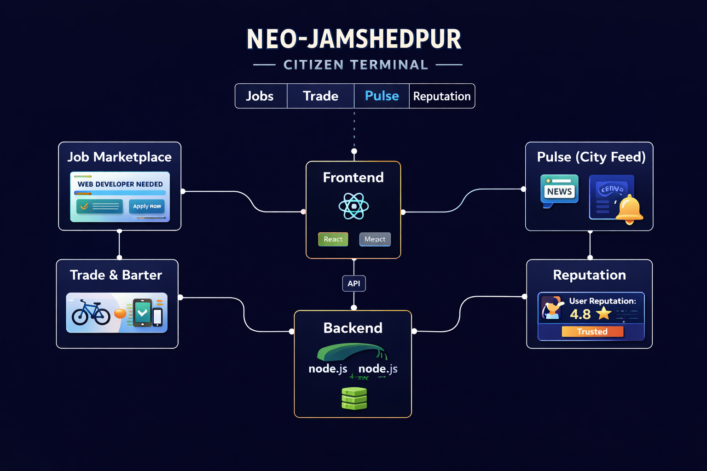
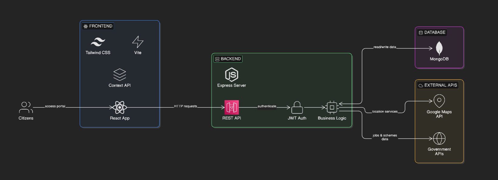
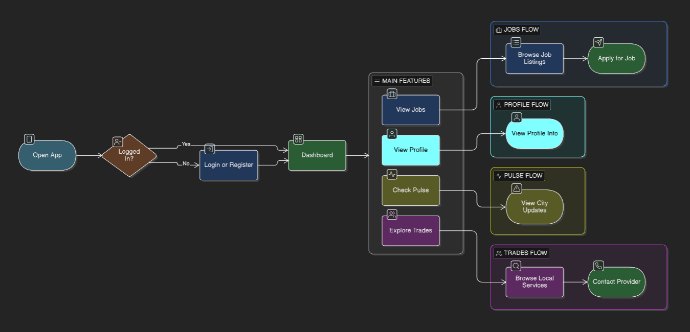
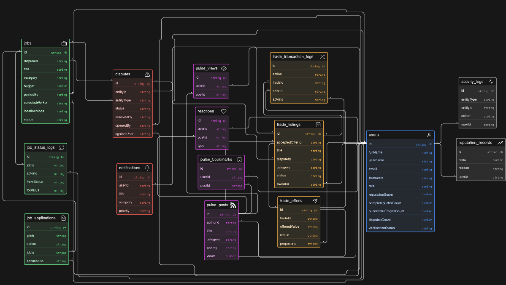

<p align="center">
  
</p>

# 🚀 Neo-Jamshedpur Citizen Terminal

<p align="center">
  
  
  
  
  
</p>

---

## 🌐 Overview

**Neo-Jamshedpur Citizen Terminal** is a unified digital platform designed to empower citizens by combining multiple essential services into a single interface.

It acts as a **mini super-app for urban communities**, integrating:

- 💼 Job & task marketplace  
- 🔁 Resource exchange / barter system  
- 📰 Real-time city updates & alerts  
- 🔔 Notification & reputation system  

> ⚡ Built to make city services **simple, fast, and accessible for Indian users**

---

## ✨ Features

### 🧑‍💼 Job Marketplace
- Post and apply for local jobs & gigs  
- Hyper-local opportunities  
- Skill-based listings  

### 🔄 Trade & Barter System
- Exchange goods/services like OLX  
- Community-driven marketplace  
- Low/no money transactions  

### 📰 Pulse (City Feed)
- Real-time updates  
- News, alerts, announcements  
- Twitter-like feed  

### 🔔 Notifications System
- Real-time alerts  
- Activity tracking  
- Important updates  

### ⭐ Reputation System
- User trust score  
- Community moderation  
- Better reliability  

---

## 🧱 Tech Stack

### 🔹 Frontend
- React.js  
- Tailwind CSS / CSS  
- Axios  

### 🔹 Backend
- Node.js  
- Express.js  

### 🔹 Database
- MongoDB  

### 🔹 Tools
- Git & GitHub  
- VS Code  
- Postman  

---

## 📁 Project Structure
```text
neo-jamshedpur-citizen-terminal/
├── backend/
│   ├── src/
│   │   ├── app.js
│   │   ├── server.js
│   │   ├── config/
│   │   ├── constants/
│   │   ├── controllers/
│   │   ├── middleware/
│   │   ├── models/
│   │   ├── routes/
│   │   ├── seeds/
│   │   ├── services/
│   │   ├── utils/
│   │   └── validators/
│   ├── .env.example
│   └── package.json
├── frontend/
│   ├── public/
│   ├── src/
│   │   ├── api/
│   │   ├── app/
│   │   ├── components/
│   │   ├── hooks/
│   │   ├── lib/
│   │   ├── pages/
│   │   ├── store/
│   │   └── styles/
│   ├── .env.example
│   ├── package.json
│   ├── tailwind.config.js
│   └── vite.config.js
├── package.json
└── README.md
```

## 🏗️ Architecture Diagram

<p align="center">
  
</p>

## 🔄 Data Flow Diagram

<p align="center">
  
</p>

## 🗄️ Database Schema

<p align="center">
  
</p>

## ⚙️ Installation & Setup

### 1️⃣ Clone the repository
```bash
git clone https://github.com/subh-sinha/Neo-Jamshedpur-Terminal.git
cd Neo-Jamshedpur-Terminal

```
### 2️⃣ Install dependencies
```bash
cd frontend
npm install
npm run dev
```

### 2️⃣ Environment Variables
```bash
PORT=5000
MONGO_URI=your_mongodb_connection_string
JWT_SECRET=your_secret_key
```
